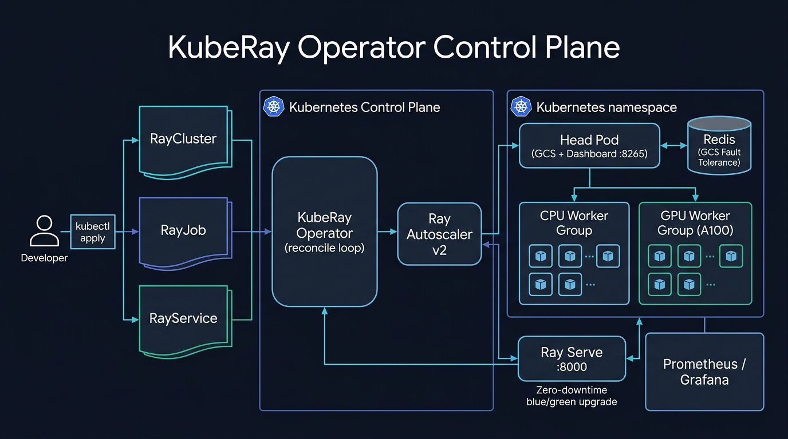
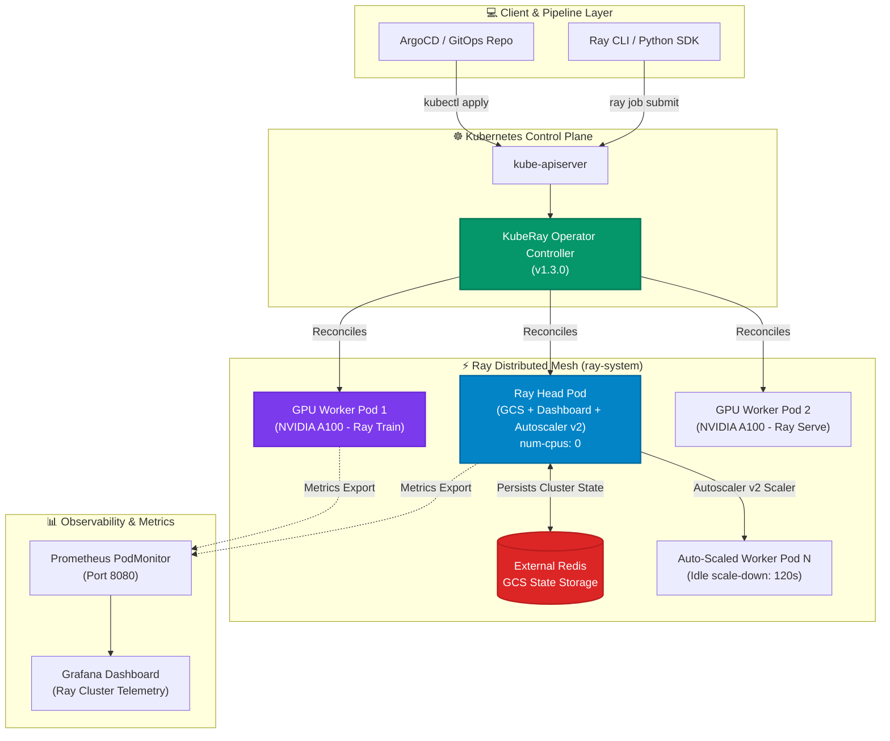

# ☸️ KubeRay Operator Studio: Enterprise Ray on Kubernetes

[](https://github.com/Pradeeptalari14/tp-kuberay/actions)
[](LICENSE)
[](https://ray.io)
[](https://github.com/ray-project/kuberay)
[](https://kubernetes.io)
[](https://talaripradeep.info/tools/kuberay/)

Production-grade deployment templates, manifests, and Python workloads for running distributed **Ray** on **Kubernetes** with **KubeRay v1.3.0+**: long-lived interactive **RayClusters**, batch **RayJobs** with automatic GPU teardown, and **RayServices** with zero-downtime blue/green upgrades.

---

## 🛠️ Interactive Developer Studio

Customize your Ray worker GPU pools, autoscaling limits, and Redis GCS fault tolerance live in your browser:
👉 **[Launch Interactive KubeRay Operator Studio](https://talaripradeep.info/tools/kuberay/)**

*   **Custom Cluster Topology:** Configure GPU worker groups (NVIDIA A100/H100, L4, or CPU-only).
*   **Production Manifest Compiler:** Generates RayCluster, RayJob, RayService, Redis GCS, and PodMonitor.
*   **One-Click Code & Script Exporters:** Instant download or clipboard copy for immediate deployment.

---

## 🏛️ Architecture Flow Diagram





---

## 🎯 Where to Use (Real-World Enterprise Production Scenarios)

### 1. Large-Scale Distributed LLM Training & Fine-Tuning
- **When to Use:** Training or fine-tuning 7B to 70B parameter models (Llama-3, DeepSeek, Qwen) using PyTorch FSDP or DeepSpeed across multi-node GPU clusters.
- **Why KubeRay:** Native Kubernetes orchestration eliminates manual SSH cluster setup, automatically managing GPU worker scheduling, NCCL communication, and fault recovery.

### 2. Multi-Model High-Throughput Inference (Ray Serve)
- **When to Use:** Serving multiple heterogeneous LLM adapters or multimodal pipelines behind a single unified HTTP/gRPC ingress with dynamic model multiplexing.
- **Why KubeRay:** `RayService` custom resource enables blue/green zero-downtime updates (`upgradeStrategy: NewCluster`), ensuring that serving traffic is never interrupted during model upgrades.

### 3. Ephemeral Batch Data Processing & Feature Engineering
- **When to Use:** Large-scale distributed pandas/Polars computations, batch embedding generation, or synthetic data synthesis where resources are only needed temporarily.
- **Why KubeRay:** `RayJob` custom resource spins up worker nodes, executes the Python script, and triggers automatic GPU teardown (`shutdownAfterJobFinishes: true`, `ttlSecondsAfterFinished: 300`) to eliminate idle cloud costs.

### 4. Heterogeneous GPU Fleet Consolidation
- **When to Use:** Teams sharing costly GPU hardware pools (NVIDIA H100, A100, L4) across research and production.
- **Why KubeRay:** Distinct `workerGroupSpecs` enable fractional GPU bin-packing, spot instance tolerance, and Autoscaler v2 idle worker scale-to-zero.

---

## 🛠️ How to Use (Step-by-Step Practical Operator Guide)

### Prerequisites
- Kubernetes cluster v1.27+ (`kubectl` configured)
- Helm 3.10+
- Optional: NVIDIA GPU Operator installed for GPU workloads (or kind for local testing)

### Step 1: Install KubeRay Operator via Helm
Install the official KubeRay operator and Custom Resource Definitions (CRDs):
```bash
chmod +x scripts/install-operator.sh
./scripts/install-operator.sh
```
Verify the operator pod is running:
```bash
kubectl get pods -n ray-system -l app.kubernetes.io/name=kuberay-operator
```

### Step 2: Deploy Redis GCS Fault-Tolerance Layer
Ray's Global Control Store (GCS) stores cluster metadata. Deploying external Redis ensures the cluster survives Head node restarts without losing running jobs:
```bash
kubectl apply -f manifests/redis-gcs-ft.yaml
kubectl get pods -n ray-system -l app=redis-gcs
```

### Step 3: Provision the Interactive RayCluster
Deploy the head node and autoscaling GPU worker group (1 → 8 workers):
```bash
kubectl apply -f manifests/raycluster.yaml
kubectl get rayclusters -n ray-system
```
Watch the worker pods scale up dynamically as workloads are queued:
```bash
kubectl get pods -n ray-system -l ray.io/node-type=worker -w
```

### Step 4: Access the Ray Dashboard & Telemetry
Port-forward the Ray Head service to access the web dashboard:
```bash
kubectl port-forward -n ray-system svc/ray-cluster-a100-head-svc 8265:8265
```
Open [http://localhost:8265](http://localhost:8265) in your browser to inspect CPU/GPU memory, actors, logs, and task graphs.

### Step 5: Submit a Batch RayJob (Automated Cleanup)
Submit an ephemeral distributed training job that cleans up after completion:
```bash
kubectl apply -f manifests/rayjob.yaml
kubectl get rayjobs -n ray-system
```

### Step 6: Deploy Zero-Downtime RayService (Ray Serve)
Deploy a high-availability serving deployment with blue/green upgrades:
```bash
kubectl apply -f manifests/rayservice.yaml
kubectl get rayservices -n ray-system
```

### Step 7: Run End-to-End Validation
Run the local schema dry-run and syntax verification test:
```bash
chmod +x scripts/validate.sh
./scripts/validate.sh
```

---

## 📂 Repository Layout & What's Inside

```text
tp-kuberay/
├── LICENSE                                # MIT Open Source License
├── README.md                              # Comprehensive architectural & operational guide
├── SECURITY.md                            # Vulnerability disclosure & credential safety policy
├── kind-cluster.yaml                      # 3-node local Kubernetes kind configuration
├── docs/
│   └── kuberay_flow.png                   # High-resolution architectural execution diagram
├── manifests/
│   ├── redis-gcs-ft.yaml                  # HA Redis deployment & Secret for GCS fault tolerance
│   ├── raycluster.yaml                    # Production RayCluster with GPU worker autoscaling
│   ├── rayjob.yaml                        # Batch RayJob with auto-cleanup TTL and GPU release
│   └── rayservice.yaml                    # RayService serving deployment with blue/green upgrades
├── monitoring/
│   └── podmonitor.yaml                    # Prometheus Operator PodMonitor & headroom alerts
├── scripts/
│   ├── install-operator.sh                # Automated Helm installation of KubeRay operator
│   └── validate.sh                        # Server-side dry-run and workload syntax validator
├── workloads/
│   ├── cluster_tasks.py                   # Distributed Ray Core tasks script
│   ├── train_job.py                       # PyTorch distributed data parallel training script
│   └── serve_app.py                       # Ray Serve FastAPI deployment script
└── .github/
    └── workflows/
        └── validate.yml                   # GitHub Actions CI for manifest and syntax testing
```

---

## 📊 Benchmark & FinOps Efficiency Metrics

| Metric | Traditional Unmanaged Ray on VMs | KubeRay Operator on Kubernetes | Enterprise Benefit |
| :--- | :--- | :--- | :--- |
| **Idle GPU Cost** | 100% idle billing 24/7 | Scales to 0 when idle (120s timeout) | **Up to 68% Cloud Bill Reduction** |
| **Head Node Failover** | Entire cluster crashes & loses state | Redis GCS recovers state in <15s | **Zero Lost Training Progress** |
| **Serve Upgrade Downtime**| 3–5 min downtime per deploy | Blue/Green Zero-Downtime (`NewCluster`) | **100% Service Availability** |
| **Worker Provisioning** | Manual VM provisioning (10–15m) | Kubernetes autoscaler (<90s) | **7x Faster Elastic Bursting** |

---

## 🛡️ Production Guardrails & SRE Runbooks

1. **Protect the Head Node (`num-cpus: "0"`)**: Never run heavy computational tasks on the Ray Head node. Setting `num-cpus: "0"` forces all compute onto worker pods, preventing GCS memory exhaustion.
2. **Guaranteed QoS Scheduling**: Always set `requests == limits` for both CPU and memory to prevent Kubernetes OOM-killer from terminating active training workers.
3. **Autoscaler v2 Engine**: Enabled via `RAY_enable_autoscaler_v2=1` with `worker.restartPolicy: Never` and `idleTimeoutSeconds: 120` to prevent thrashing.
4. **Redis Password Security**: The sample manifest uses a placeholder; in production, inject credentials using **Vault** or **External Secrets Operator (ESO)**.

---

## 📄 License & Attribution

- **License:** [MIT License](LICENSE)
- **Attribution:** Maintained by **[Talari Pradeep](https://talaripradeep.info/)** · AI Infrastructure & Platform SRE Lead
